# 2025 特殊涂装

按大奖赛整理 2025 赛季的特殊涂装。日期取该站比赛最后一天；重复使用的设计在卡片说明中列出其他站次。

## 3 - 日本大奖赛（2025年4月6日）

### Red Bull Racing - Honda RA272 60 周年致敬

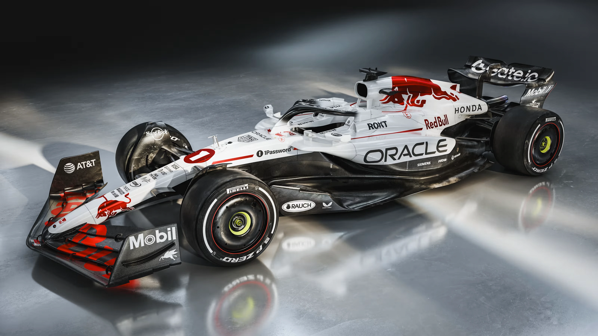

白红配色致敬 Honda RA272 及 Honda 首次 F1 胜利 60 周年。

来源：[F1 官方专题](https://www.formula1.com/en/latest/article/gallery-red-bull-unveil-special-white-and-red-livery-for-japanese-grand-prix.6ed0ssKwGkFA30a0HpfSVN.6ed0ssKwGkFA30a0HpfSVN.6ed0ssKwGkFA30a0HpfSVN.6ed0ssKwGkFA30a0HpfSVN.6ed0ssKwGkFA30a0HpfSVN)

### Haas - Sakura

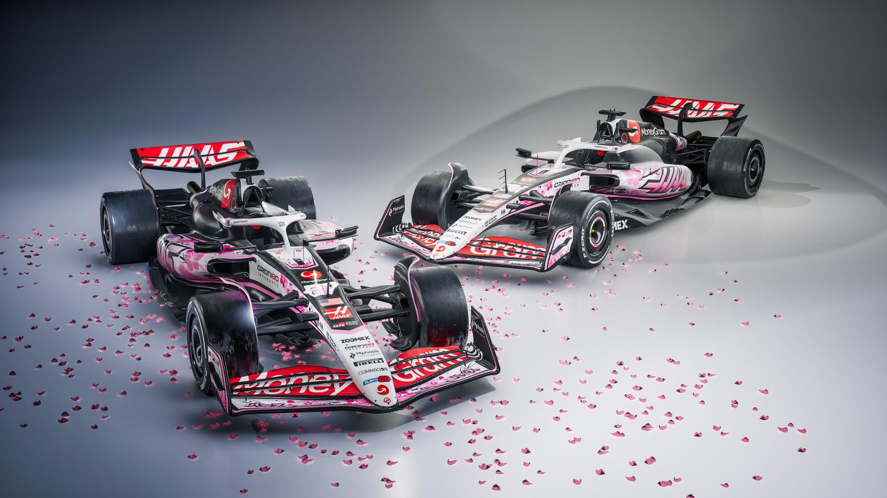

樱花主题的日本站特别设计。

来源：[Haas 官方预告](https://www.haasf1team.com/news/japanese-grand-prix-preview-2)

## 6 - 迈阿密大奖赛（2025年5月4日）

### Kick Sauber - Miami Art Car

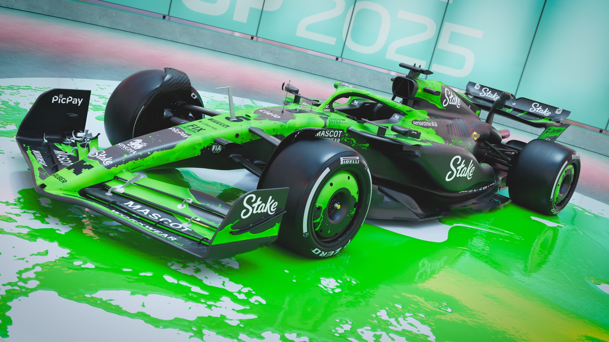

迈阿密艺术车视觉，加入鲜明荧光色图形。

来源：[F1 官方专题](https://www.formula1.com/en/latest/article/gallery-kick-sauber-reveal-special-art-inspired-livery-for-miami-grand-prix.5g1iZi9PRy3nJTsWoLOErG)

### Ferrari - Miami Blue

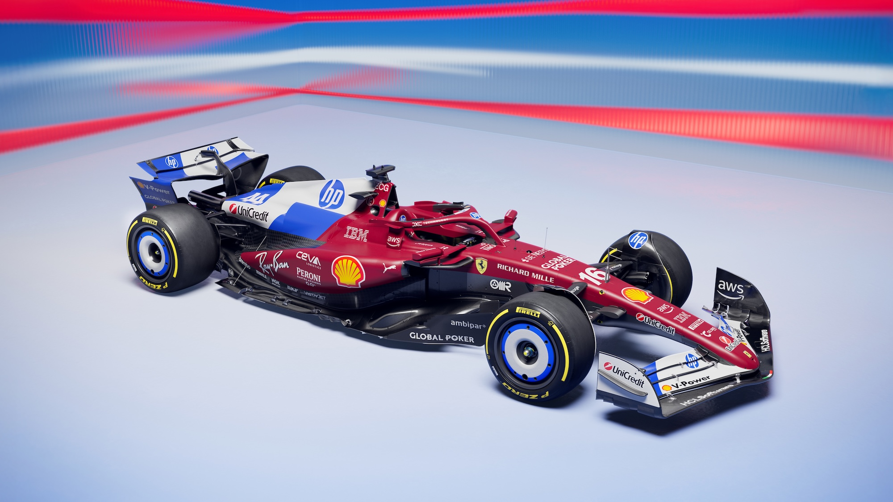

蓝白配色与迈阿密主场主题设计。

来源：[F1 官方专题](https://www.formula1.com/en/latest/article/gallery-ferrari-reveal-special-co-designed-livery-for-miami-grand-prix.bIA2nDHqo3SYRp150gl00)

### Racing Bulls - White Peach

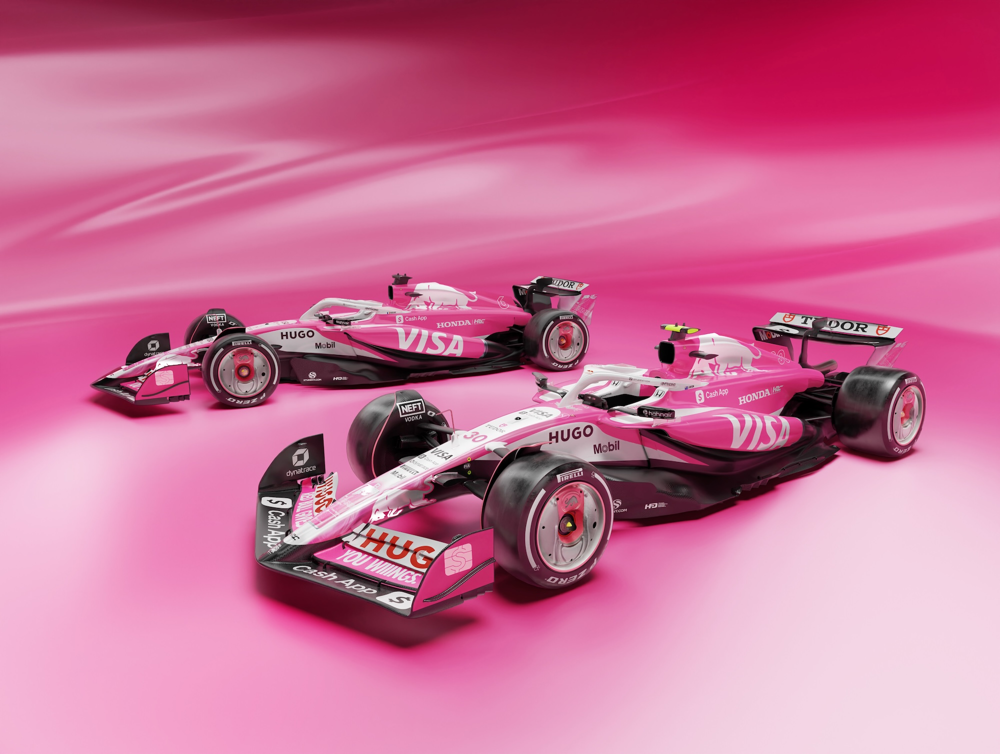

与 White Peach 联名的粉色迈阿密特别涂装。

来源：[F1 官方专题](https://www.formula1.com/en/latest/article/gallery-racing-bulls-unveil-striking-special-livery-for-miami-grand-prix.5m4UDgNDO62QX1OTdxAF5H)

## 8 - 摩纳哥大奖赛（2025年5月25日）

### McLaren - Riviera · M7A 致敬

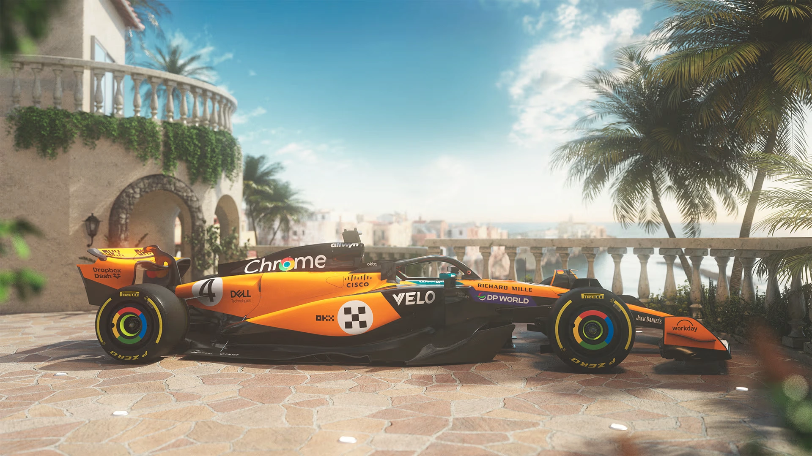

蓝白色调向经典 M7A 赛车致敬；同一设计也用于西班牙大奖赛（2025年6月1日）。

来源：[F1 官方专题](https://www.formula1.com/en/latest/article/mclaren-reveal-tweaked-riviera-inspired-livery-for-monaco-and-spanish-grands.697HMvtQmLBNNiZilwTTUH)

## 9 - 西班牙大奖赛（2025年6月1日）

### Kick Sauber - Glitched Out

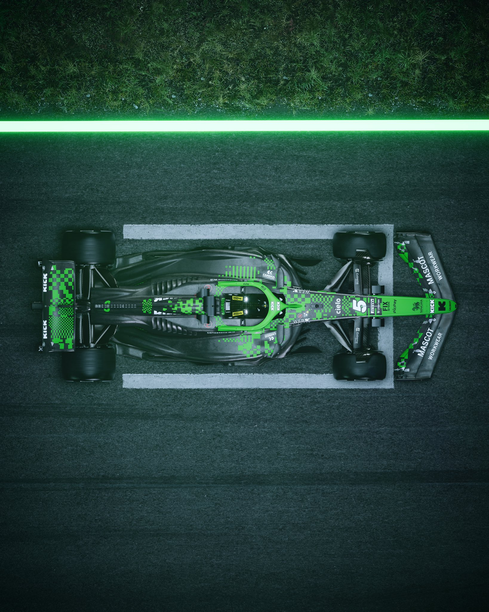

车身加入像素化图案，呼应“Glitched Out”主题。

来源：[AutoHebdo 2025 特涂图集](https://www.autohebdof1.com/news/f1/in-pictures-all-the-special-liveries-for-the-2025-season.html) · [F1 官方赛道图片](https://www.formula1.com/en/latest/article/what-the-teams-said-friday-in-spain-2025.5KWLJkoF4W06tSXZt8LWK3) · [Sauber 新闻稿](https://lulop.com/en_EN/post/show/326214/kick-sauber-f1-team-goes-digit.html)

## 10 - 加拿大大奖赛（2025年6月15日）

### Haas - 200th Grand Prix · 2016 Throwback

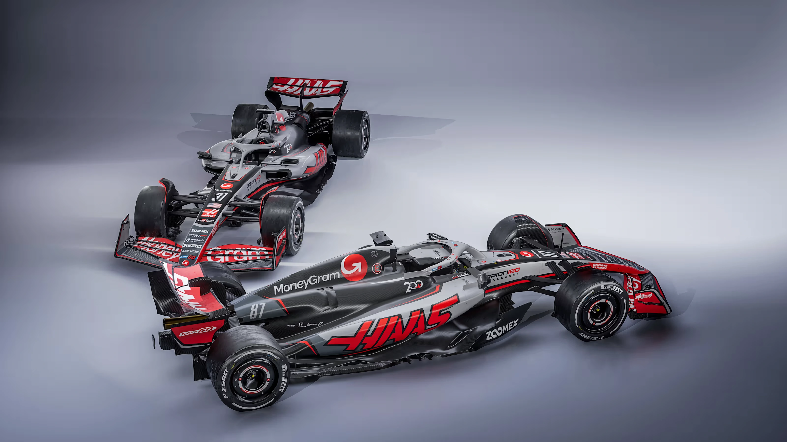

纪念车队参加 F1 的第 200 场大奖赛，外观致敬 2016 年首赛季涂装。

来源：[F1 官方专题](https://www.formula1.com/en/latest/article/gallery-check-out-haas-special-livery-for-their-200th-grand-prix-in-canada.4Q38Lnr7Gnkyr4tbW3qUVK.4Q38Lnr7Gnkyr4tbW3qUVK.4Q38Lnr7Gnkyr4tbW3qUVK.4Q38Lnr7Gnkyr4tbW3qUVK)

## 12 - 英国大奖赛（2025年7月6日）

### McLaren - Chrome

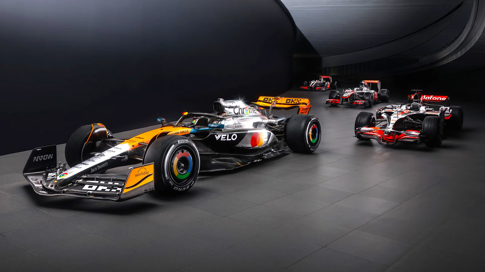

为主场银石站加入镀铬质感元素。

来源：[F1 官方专题](https://www.formula1.com/en/latest/article/mclaren-reveal-chrome-livery-for-silverstone.205orpMlPrDyyjorzSdh8f)

### Racing Bulls - Slawn × HUGO

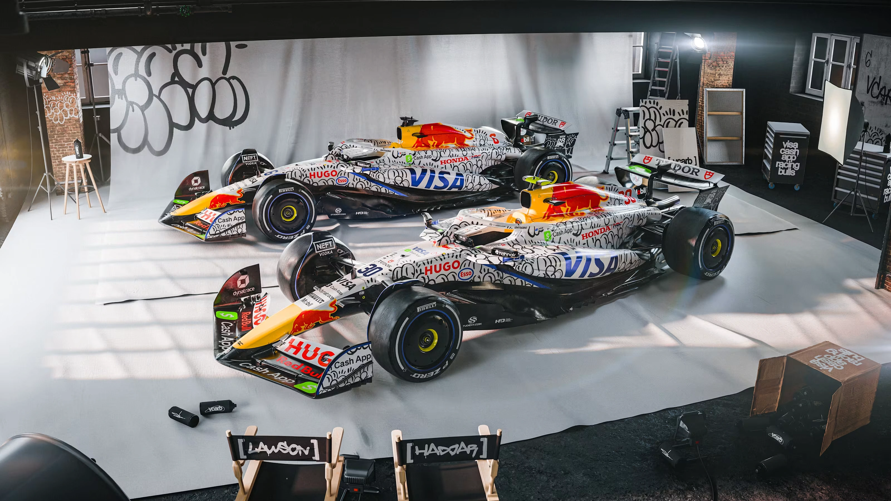

与艺术家 Slawn 和 HUGO 合作设计。

来源：[F1 官方专题](https://www.formula1.com/en/latest/article/gallery-racing-bulls-unveil-special-livery-for-british-grand-prix.3jvKET9jEaCsGlDw6NIfVK.3jvKET9jEaCsGlDw6NIfVK.3jvKET9jEaCsGlDw6NIfVK)

### Mercedes - W16 · Orange Accents

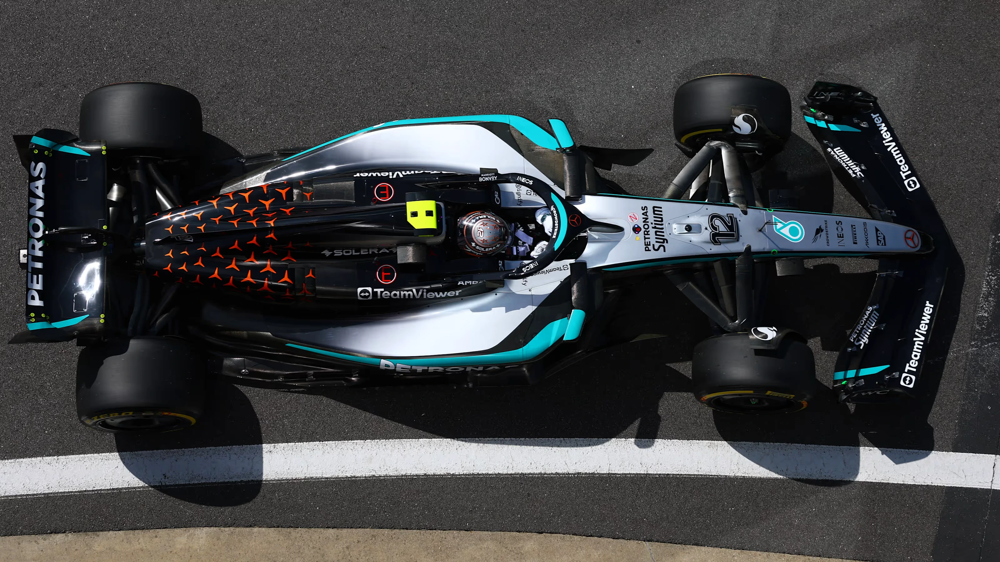

W16 加入 Sunset Beam Orange 橙色细节；此图能看到整车及车身橙色点缀。

来源：[Mercedes 官方说明](https://www.mercedesamgf1.com/news/why-will-we-have-orange-on-our-british-grand-prix-livery) · [F1 官方赛道照片](https://www.formula1.com/en/latest/article/what-the-teams-said-friday-in-great-britain-2025.6CnC4JIshE4cFWEzjHZrLt)

### Williams - Union Flag Nose Detail

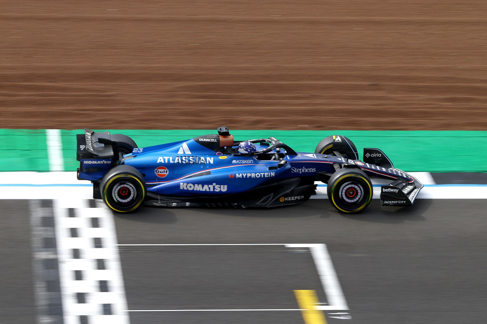

小幅主场细节更新，车鼻加入英国国旗图案。

来源：[Williams 官方专题](https://www.williamsf1.com/articles/85c210a4-b2af-4495-802f-87dcba6f5d4c/home-race-home-colours)

## 16 - 意大利大奖赛（2025年9月7日）

### Ferrari - Lauda · 1975 312T Tribute

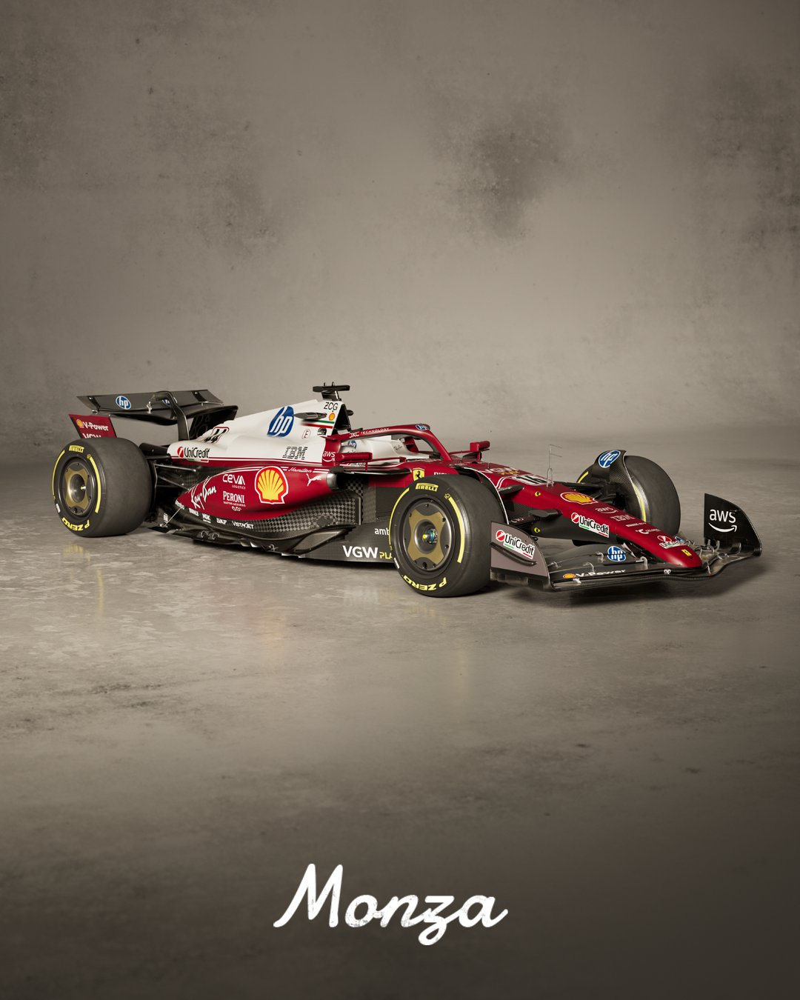

纪念 Niki Lauda 与 Ferrari 在 1975 年取得的首个车手和车队双冠。

来源：[AutoHebdo 2025 特涂图集](https://www.autohebdof1.com/news/f1/in-pictures-all-the-special-liveries-for-the-2025-season.html) · [F1 官方专题](https://www.formula1.com/en/latest/article/gallery-check-out-ferraris-retro-livery-for-the-italian-grand-prix-at-monza.5tPS5HM6Y8PlR0jeMxXrDR)

## 19 - 美国大奖赛（2025年10月19日）

### Williams - 2002 Throwback

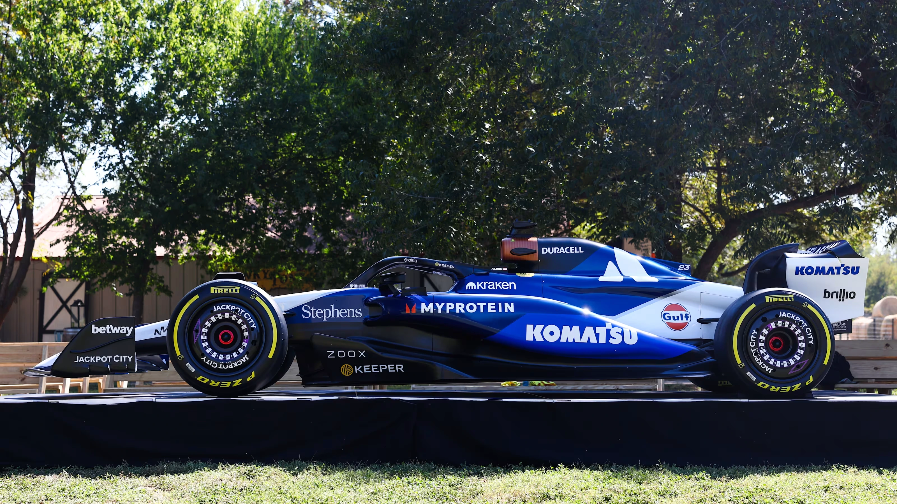

向 2002 年涂装致敬，以纪念 Atlassian 成立年份。

来源：[Williams 官方专题](https://www.williamsf1.com/articles/3997b107-2be3-4ccf-a650-4b6b5aafb0d9/williams-unveils-iconic-2002-celebrating-atlassian-partnership) · [F1 官方专题](https://www.formula1.com/en/latest/article/gallery-check-out-williams-racing-bulls-mclaren-haas-and-aston-martins.35IUALywE63IuFKCXqIgw7.35IUALywE63IuFKCXqIgw7)

### Racing Bulls - Tortoiseshell

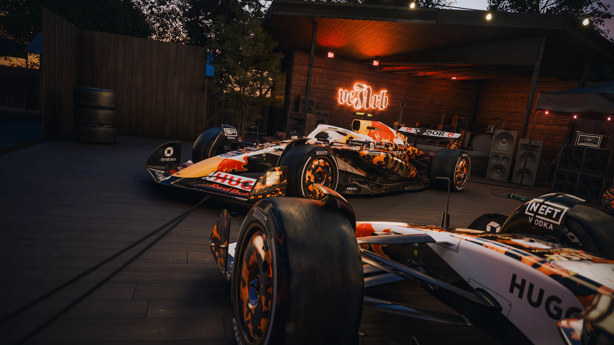

龟甲纹主题设计，伴随 Shaboozey 在奥斯汀亮相。

来源：[F1 官方专题](https://www.formula1.com/en/latest/article/gallery-check-out-williams-racing-bulls-mclaren-haas-and-aston-martins.35IUALywE63IuFKCXqIgw7.35IUALywE63IuFKCXqIgw7)

### Aston Martin - Invisible Science

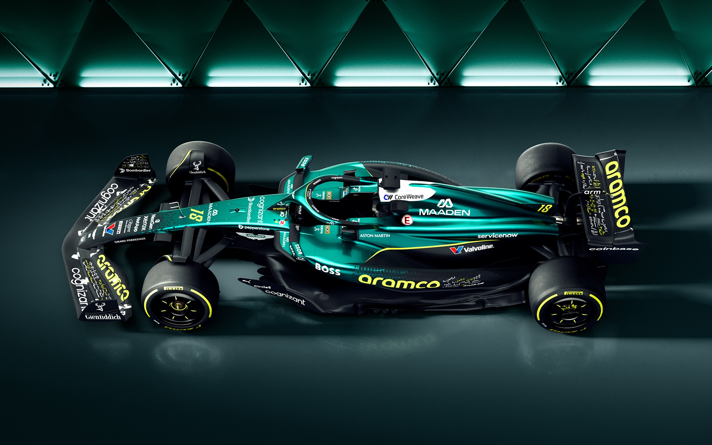

在车身上加入数学公式，主题为 F1 背后的“隐形科学”。

来源：[F1 官方专题](https://www.formula1.com/en/latest/article/gallery-check-out-williams-racing-bulls-mclaren-haas-and-aston-martins.35IUALywE63IuFKCXqIgw7.35IUALywE63IuFKCXqIgw7)

### Alpine - Mercado Libre

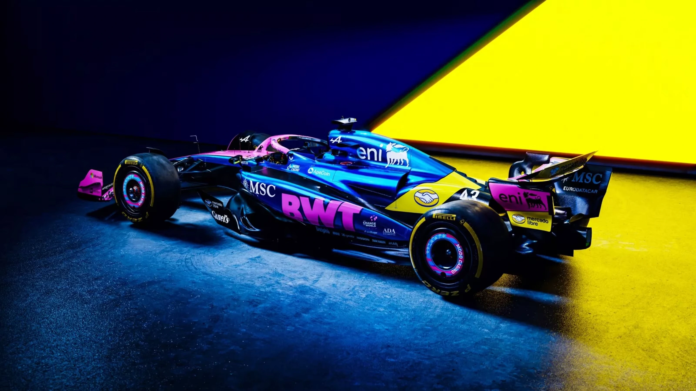

引擎罩与尾翼加入黄色元素；同一设计也用于墨西哥（2025年10月26日）和巴西/圣保罗（2025年11月9日）。

来源：[Alpine 官方新闻稿](https://media.alpinecars.com/bwt-alpine-formula-one-team-and-mercado-libre-unveil-a525-special-livery-for-races-in-americas/?lang=eng) · [F1 官方专题](https://www.formula1.com/en/latest/article/gallery-check-out-williams-racing-bulls-mclaren-haas-and-aston-martins.35IUALywE63IuFKCXqIgw7.35IUALywE63IuFKCXqIgw7)

### McLaren - Iridescent Livery Enhancement

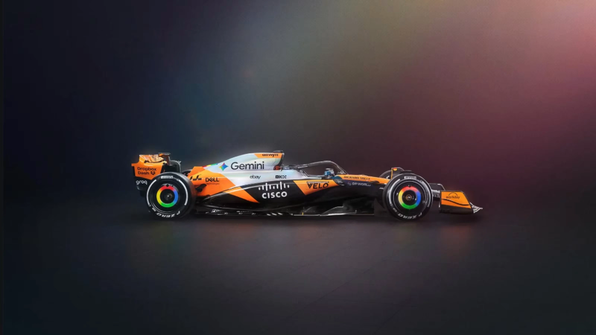

车身加入虹彩效果元素；同一增强也用于墨西哥大奖赛（2025年10月26日）。

来源：[F1 官方专题](https://www.formula1.com/en/latest/article/gallery-check-out-williams-racing-bulls-mclaren-haas-and-aston-martins.35IUALywE63IuFKCXqIgw7.35IUALywE63IuFKCXqIgw7)

### Haas - Stars & Stripes

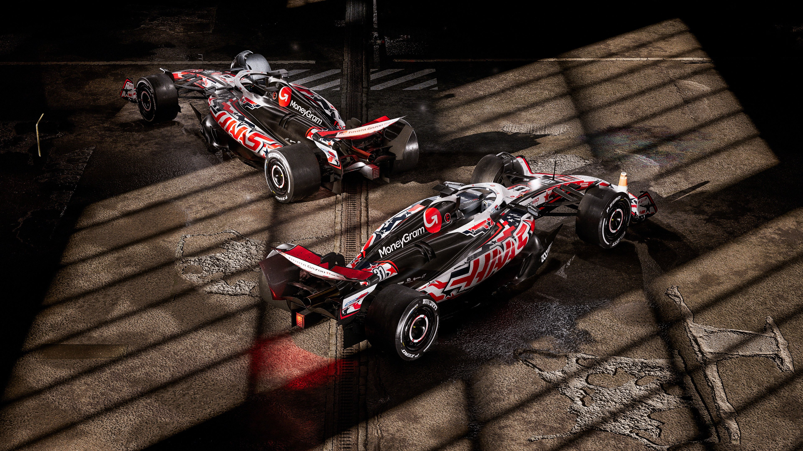

美国主场采用星条旗主题设计。

来源：[F1 官方专题](https://www.formula1.com/en/latest/article/gallery-check-out-williams-racing-bulls-mclaren-haas-and-aston-martins.35IUALywE63IuFKCXqIgw7.35IUALywE63IuFKCXqIgw7)

## 21 - 巴西大奖赛（2025年11月9日）

### Williams - Gulf · Driven by Words

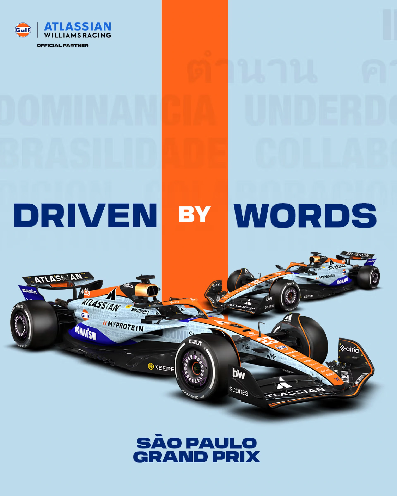

Gulf 与 Atlassian Williams Racing 合作的“Driven by Words”设计；保留官方宣传图原有文字。

来源：[Williams 官方专题](https://www.williamsf1.com/articles/a191b915-43ac-4dc9-88c0-d16e5576f856/driven-by-words-gulf-and-atlassian-williams-racing-unveil-new-livery-inspired-by-fans)

## 22 - 拉斯维加斯大奖赛（2025年11月22日）

### Williams - ROVO

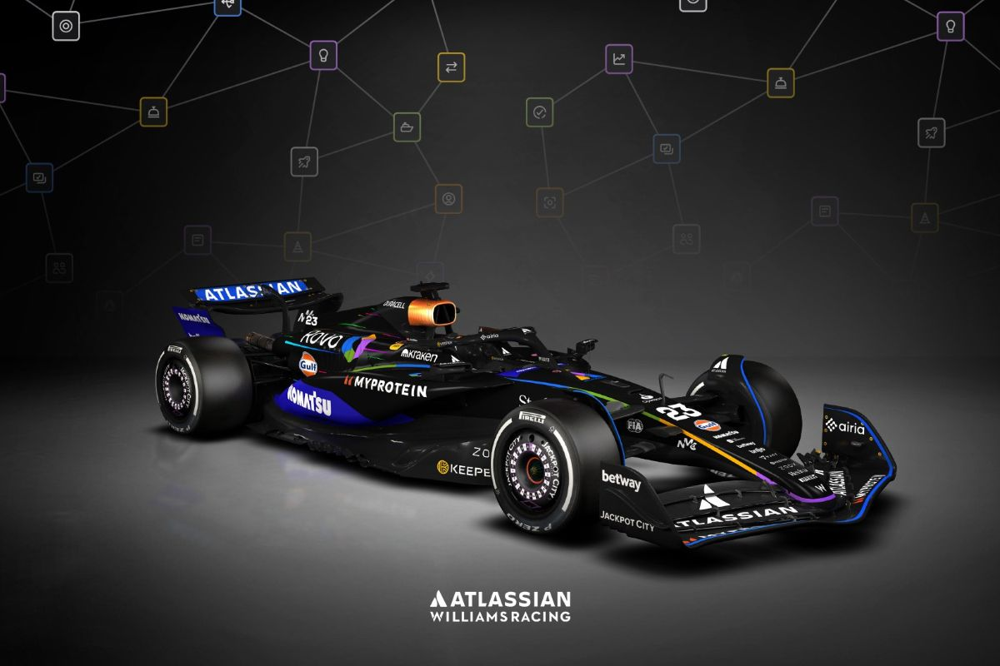

与 ROVO 合作的黑色夜赛涂装。

来源：[F1 官方专题](https://www.formula1.com/en/latest/article/gallery-check-out-williams-sauber-racing-bulls-and-alpines-special-liveries.18JjRoB0eTKr0PoaxDWENe) · [AutoHebdo 2025 特涂图集](https://www.autohebdof1.com/news/f1/in-pictures-all-the-special-liveries-for-the-2025-season.html)

### Kick Sauber - Final Lap

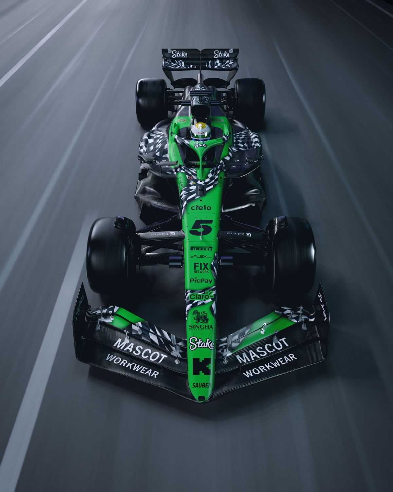

致敬车队在 F1 的最后一个赛季，以方格旗元素收尾。

来源：[F1 官方专题](https://www.formula1.com/en/latest/article/gallery-check-out-williams-sauber-racing-bulls-and-alpines-special-liveries.18JjRoB0eTKr0PoaxDWENe) · [AutoHebdo 2025 特涂图集](https://www.autohebdof1.com/news/f1/in-pictures-all-the-special-liveries-for-the-2025-season.html)

### Racing Bulls - Holo Card

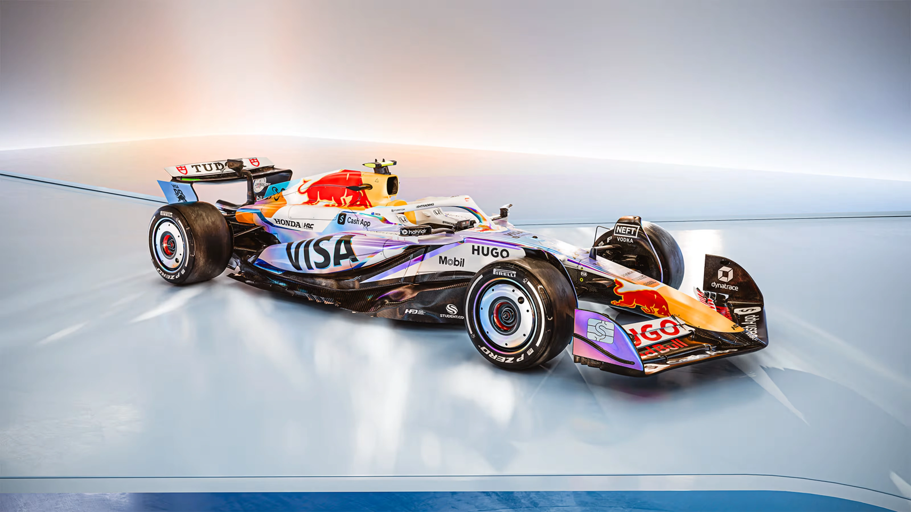

以全息卡片视觉呼应拉斯维加斯夜色。

来源：[F1 官方专题](https://www.formula1.com/en/latest/article/gallery-check-out-williams-sauber-racing-bulls-and-alpines-special-liveries.18JjRoB0eTKr0PoaxDWENe)

### Alpine - Pink Vegas

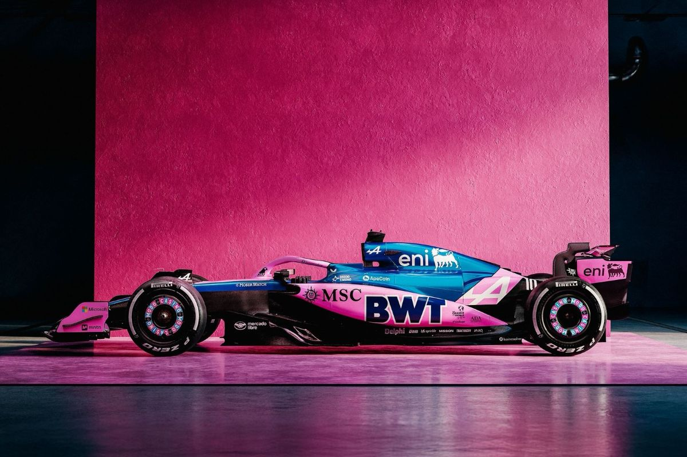

粉色主题的拉斯维加斯夜赛涂装。

来源：[F1 官方专题](https://www.formula1.com/en/latest/article/gallery-check-out-williams-sauber-racing-bulls-and-alpines-special-liveries.18JjRoB0eTKr0PoaxDWENe) · [AutoHebdo 2025 特涂图集](https://www.autohebdof1.com/news/f1/in-pictures-all-the-special-liveries-for-the-2025-season.html)

## 24 - 阿布扎比大奖赛（2025年12月7日）

### McLaren - VELO · Live Your Fandom

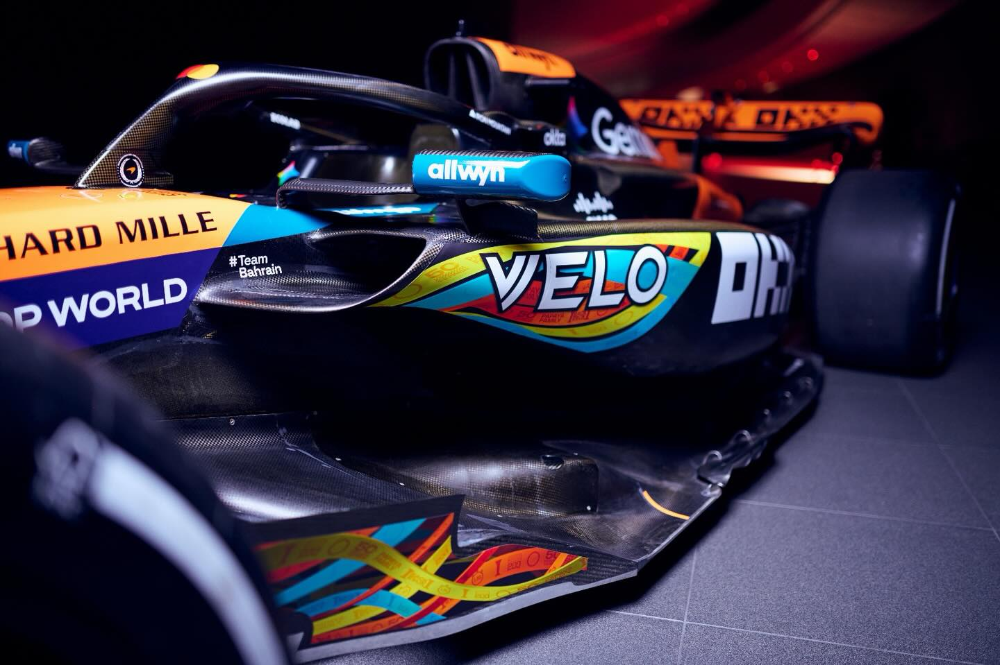

面向车迷创作的 VELO 特别涂装。

来源：[McLaren 官方专题](https://www.mclaren.com/racing/formula-1/2025/abu-dhabi-grand-prix/mclaren-formula-1-team-velo-reveal-fan-inspired-livery/)
