[TOC]

## 3 - 日本大奖赛

### Mercedes - "unleashing the beast"

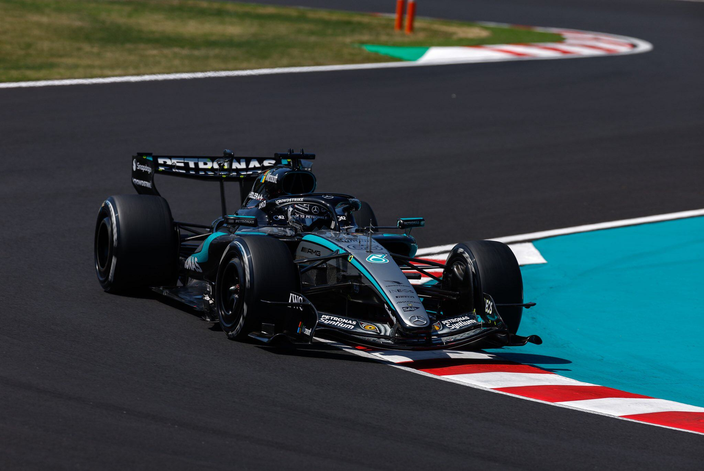

### Hass - "King of the Monsters"

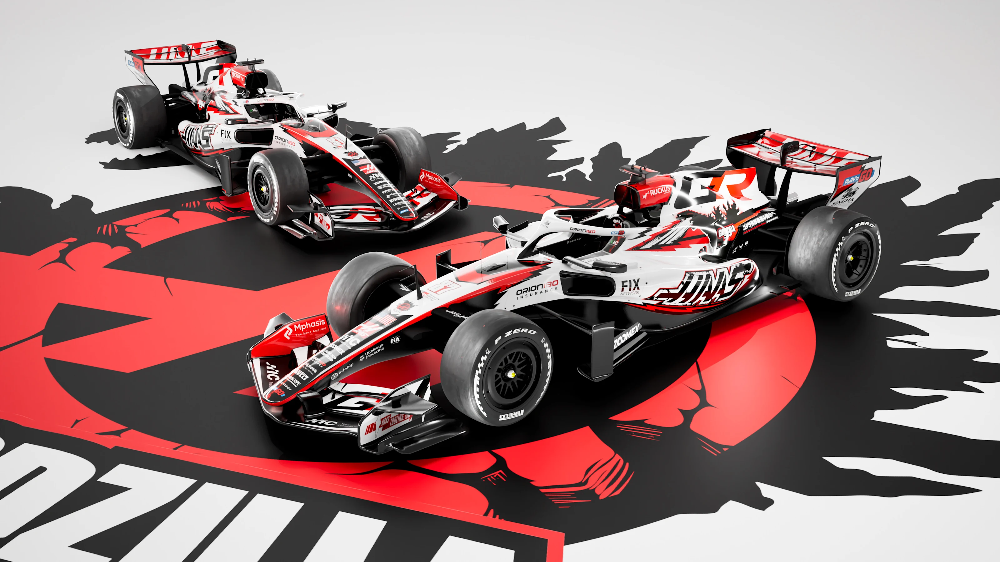

### Racing Bulls - The Elegance of Traditional Japanese Shodo Calligraphy

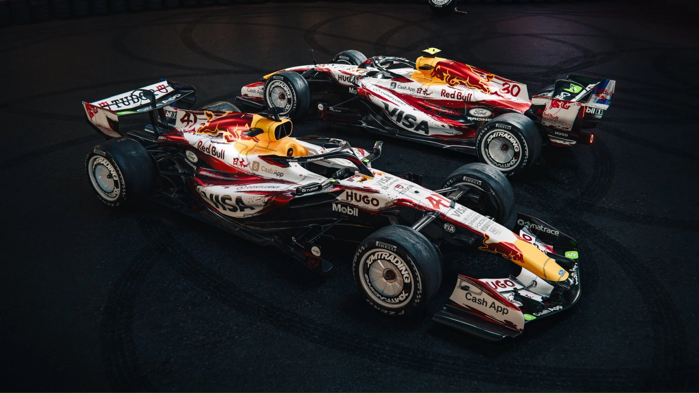

## 4 - 迈阿密大奖赛

### Racing Bulls - "Summer-Sun Yellow"

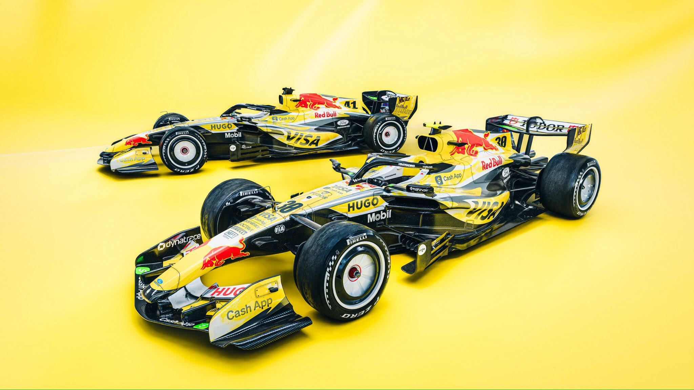

### Cadillac - Home Race

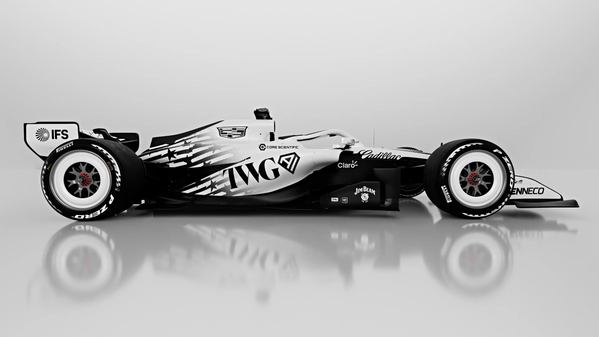

## 6 - 摩纳哥大奖赛

### Aston Martin - Maaden

the Transformation of Metals and Minerals From the Earth to High-Performance Engineering.

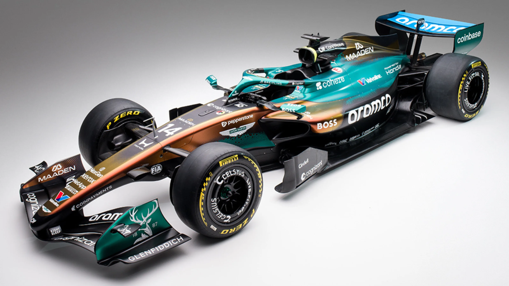

### McLaren - 1000th F1 Race

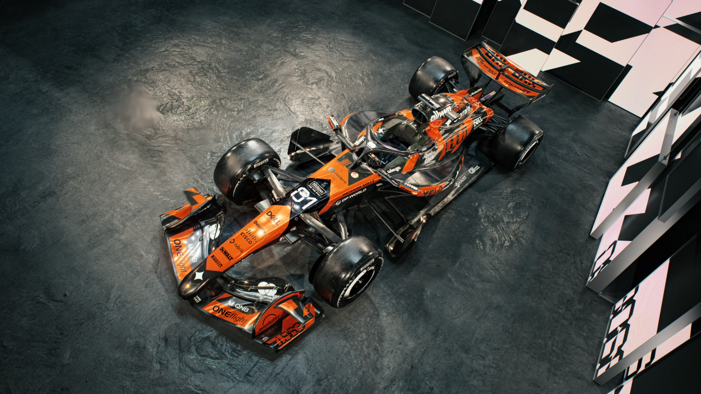

## 7 - 巴塞罗那-加泰罗尼亚大奖赛

### Racing Bulls - FIFA World Cup

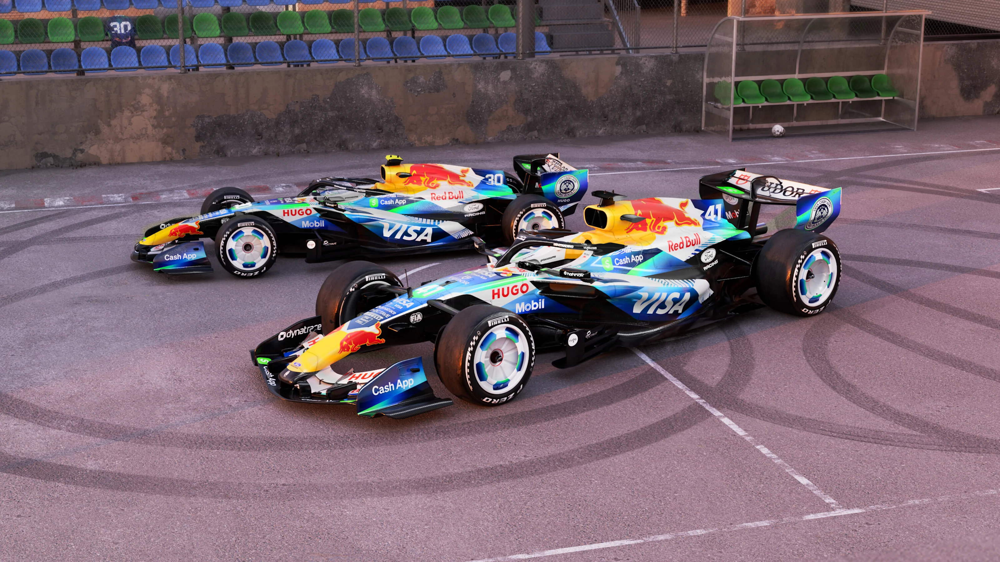

## 8 - 奥地利大奖赛

### Cadillac - Symmetrical（赛季涂装的变化）

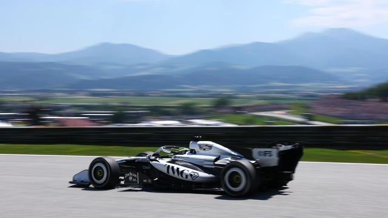

## 9 - 英国大奖赛

### Cadillac - Independence Day

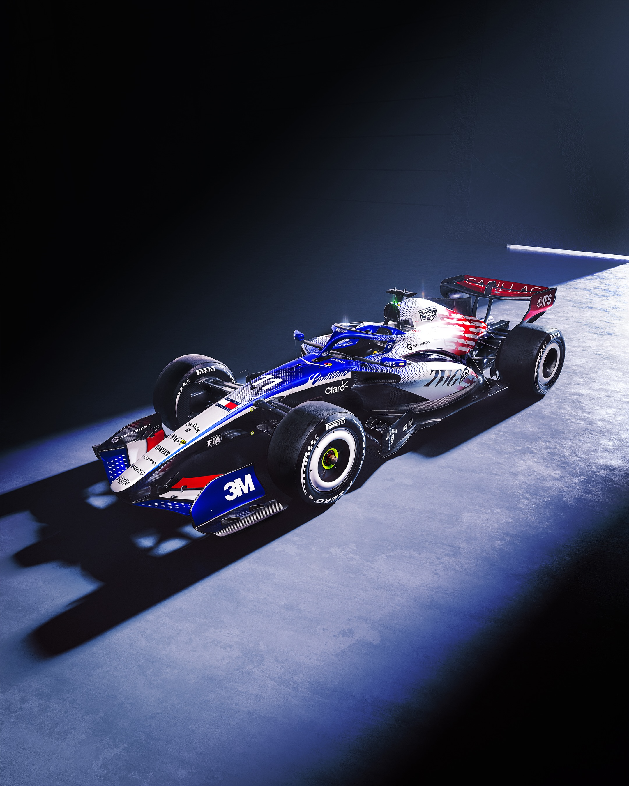

### Williams - "Union Jack-inspired"

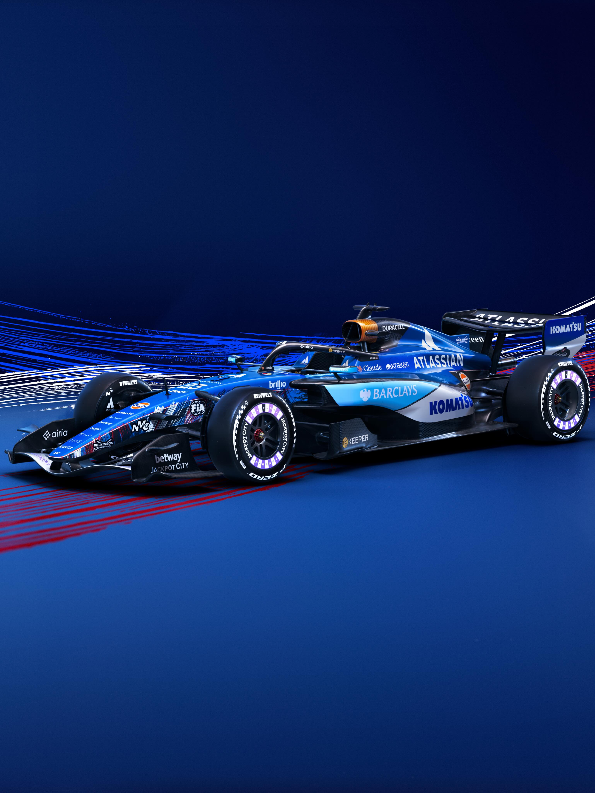

### McLaren - the McLaren M2B

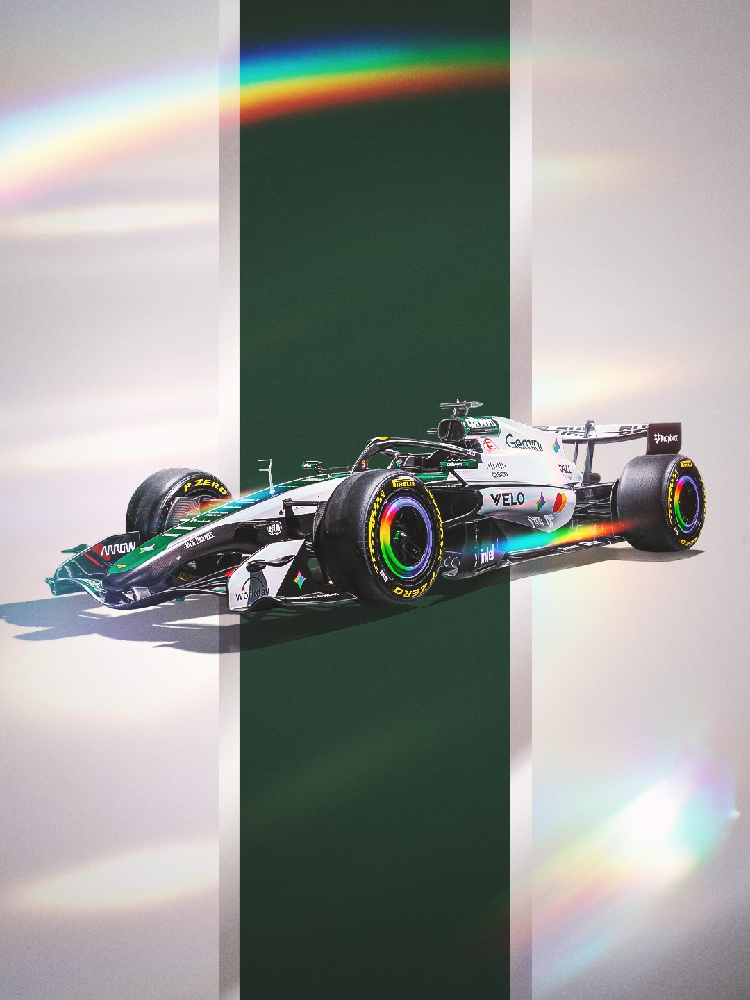

## 13 - 意大利大奖赛

### Ferrari - 致敬舒马赫

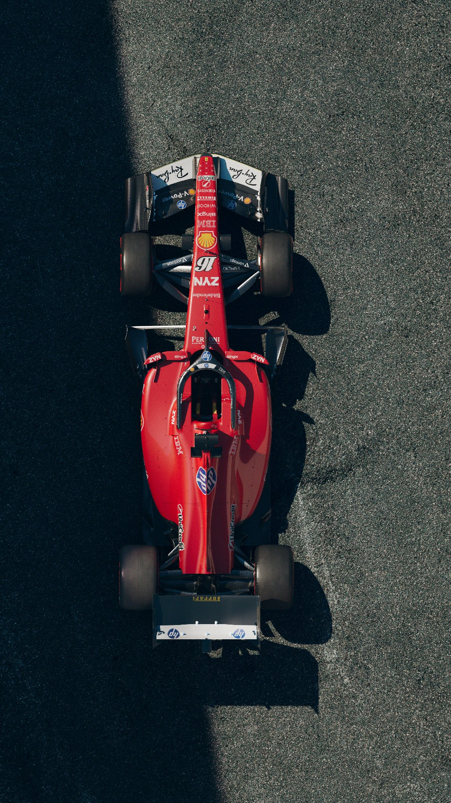

### Mclaren - OKX

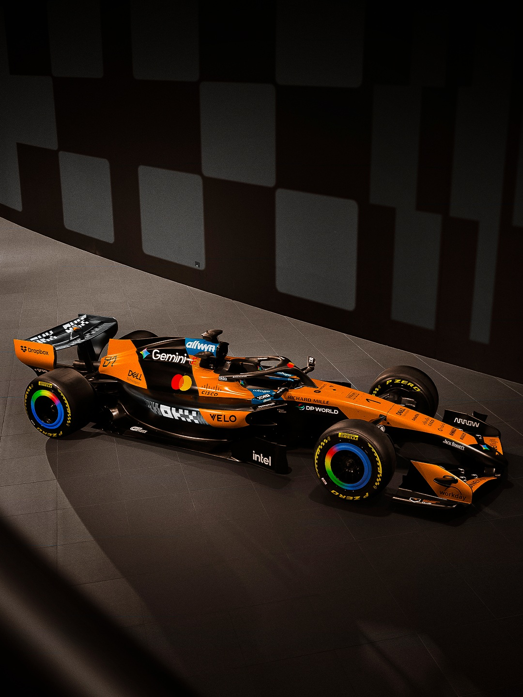